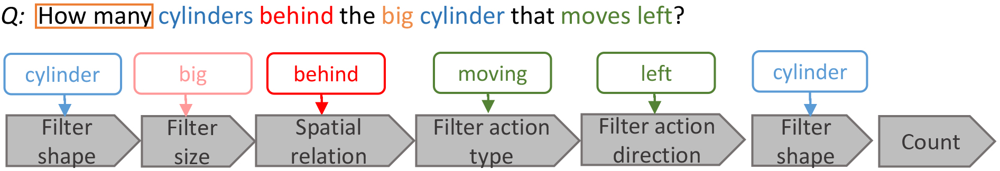

# SVQA
The SVQA(Synthetic Video Question Answering) dataset contains 12000 videos and around 120k QA pairs. Videos and QA pairs are all generated automatically with minimal language biases and clearly defined question categories. The dataset can facilitate the analysis on models reasoning skills.

# Video and QA Pair Examples
| QA Category|Question|Answer|Video(GIF)
| :----------------- | --------------------------------- | ----------------------------- | ---------------------------------------- |
|Attribute Comparison||no||
|Count||5||
|Query||blue||
|Integer Comparison||no||
|Exist||yes||

## Statistics of SVQA
| Question Category       |Sub Category|       Train |       Val  |       Test  |
| :---------------        |:------     | ----------: | ---------: | ----------: |
| **Count**               |            |     19320   |      2760  |  5520       |
| **Exist**               |            |     6720    |      960   |  1920       |
|**Query**                |Color       |     7560    |      1056  |  2160       | 
|                         |Size        |     7560    |      1056  |  2160       | 
|                         |Action Type |     6720    |      936   |  1920       | 
|                         |Direction   |     7560    |      1056  |  2160       | 
|                         |Shape       |     7560    |      1056  |  2160       |
|**Integer Comparison**   |More        |     2520    |      600   |  720        | 
|                         |Equal       |     2520    |      600   |  720        | 
|                         |Less        |     2520    |      600   |  720        |
|**Attribute Comparison** |Color       |     2520    |      216   |  720        | 
|                         |Size        |     2520    |      216   |  720        | 
|                         |Action Type |     2520    |      216   |  720        | 
|                         |Direction   |     2520    |      216   |  720        | 
|                         |Shape       |     2520    |      216   |  720        | 
| **Total QA pairs**      |            |     83160   |      11880 |  23760      |
| **Total Videos**        |            |     8400    |      1200  |  2400       |
