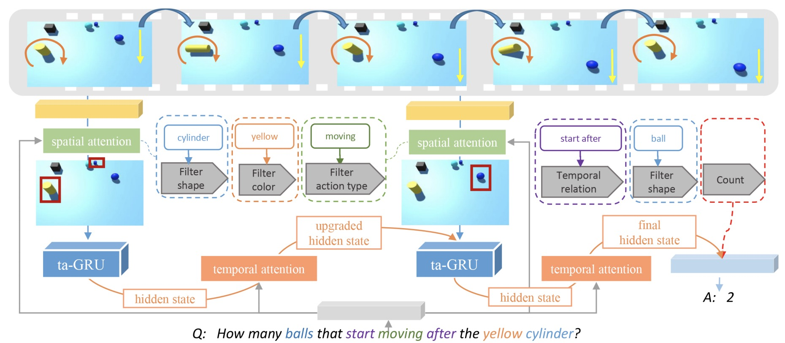

# Code

Temporal-Attention GRU
-----




Setup Instructions
-----

* Install python modules

```
pip3 install -r requirements.txt
```

* Install TensorFlow "v1.4.0"

* Download SVQA dataset from this [link]()

Extract the visual features
-----

1. Convert the video dataset to images.

2. Extract 'res5c', 'pool5' for ResNet-152, and 'conv5b', 'fc6' for C3D and make hdf5 file.

3. Process questions, generate hdf5 file.

Training
-----

To train the model, you should choose the query type. Moreover, you can specify the learning rate, batch size and run pattern.

```
python3 main.py --pattern=train --dir=final --base_learning_rate=0.001 --bsz=32
```

Evaluation
-----

To train the model, you should choose the query type.

```
python3 main.py --pattern=test --dir=final --checkpoint=/path/to/ckpt
```