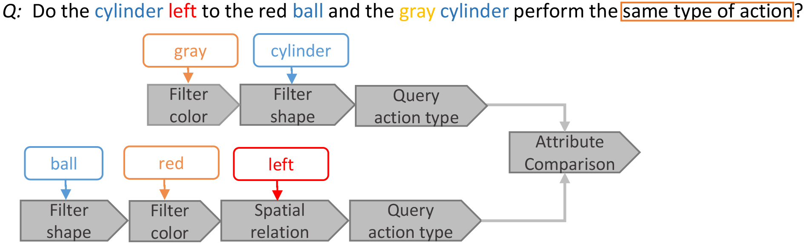
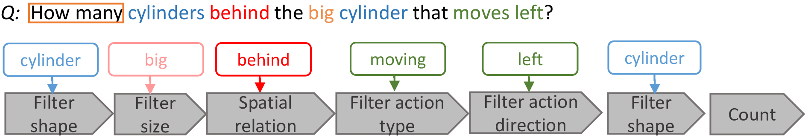
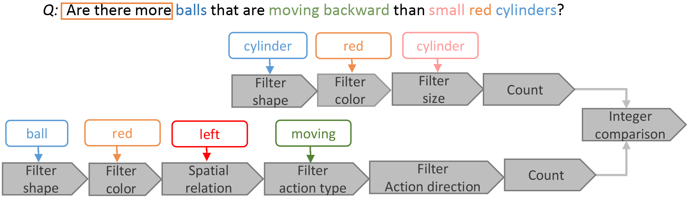
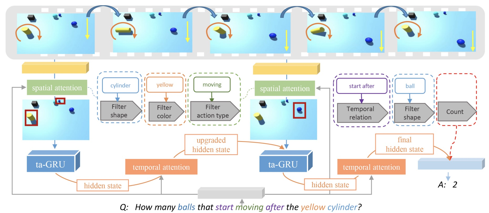
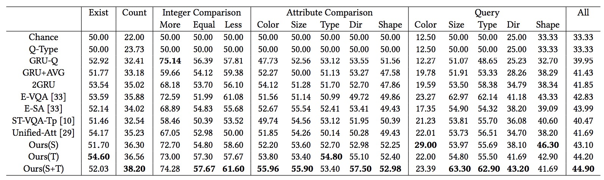
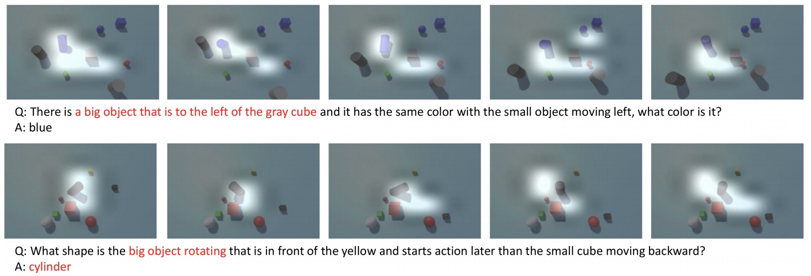

# Explore Multi-Step Reasoning in Video Question Answering

ACM MM 2018 Full Paper   Xiaomeng Song, Yucheng Shi, Xin Chen, Yahong Han

### Citation
If you find this useful in your work, please consider citing the following reference:

    @inproceedings{emrvqasongMM18,
        title = {Explore Multi-Step Reasoning in Video Question Answering},
        author = {Song, Xiaomeng and Shi, Yucheng and Chen, Xin and Han, Yahong},
        booktitle = {Proceedings of the ACM International Conference on Multimedia (ACM MM)},
        year = {2018}
    }

  
## Contents
1. [Abstract](#abstract)
2. [Dataset](#dataset)
3. [Framework](#framework)
4. [Result](#result)
4. [Code](#code)

## Abstract
Video question answering (VideoQA) always involves visual reasoning. When answering questions composing of multiple logic correlations, models need to perform multi-step reasoning. In this paper, we formulate multi-step reasoning in VideoQA as a new task to answer compositional and logical structured questions based on video content. Existing VideoQA datasets are inadequate as benchmarks for the multi-step reasoning due to limitations as lacking logical structure and having language biases. Thus we design a system to automatically generate a large-scale dataset, namely SVQA (Synthetic Video Question Answering). Compared with other VideoQA datasets, SVQA contains exclusively long and structured questions with various spatial and temporal relations between objects. More importantly, questions in SVQA can be decomposed into human readable logical tree or chain layouts, each node of which represents a sub-task requiring a reasoning operation such as comparison or arithmetic. Towards automatic question answering in SVQA, we develop a new VideoQA model. Particularly, we construct a new attention module, which contains spatial attention mechanism to address crucial and multiple logical sub-tasks embedded in questions, as well as a refined GRU called ta-GRU (temporal-attention GRU) to capture the long-term temporal dependency and gather complete visual cues. Experimental results show the capability of multi-step reasoning of SVQA and the effectiveness of our model when compared with other existing models.

## Dataset
The SVQA(Synthetic Video Question Answering) dataset contains 12000 videos and around 120k QA pairs. Videos and QA pairs are all generated automatically with minimal language biases and clearly defined question categories. The dataset can facilitate the analysis on models reasoning skills.

You can download the dataset from this [link](http://www.google.com/).

### Video and QA Pair Examples

| QA Category|Question|Answer|Video(GIF)
| :----------------- | --------------------------------- | ----------------------------- | ---------------------------------------- |
|Attribute Comparison||no||
|Count||5||
|Query||blue||
|Integer Comparison||no||
|Exist||yes||

### Statistics of SVQA

| Question Category       |Sub Category|       Train |       Val  |       Test  |
| :---------------        |:------     | ----------: | ---------: | ----------: |
| **Count**               |            |     19320   |      2760  |  5520       |
| **Exist**               |            |     6720    |      960   |  1920       |
|**Query**                |Color       |     7560    |      1056  |  2160       | 
|                         |Size        |     7560    |      1056  |  2160       | 
|                         |Action Type |     6720    |      936   |  1920       | 
|                         |Direction   |     7560    |      1056  |  2160       | 
|                         |Shape       |     7560    |      1056  |  2160       |
|**Integer Comparison**   |More        |     2520    |      600   |  720        | 
|                         |Equal       |     2520    |      600   |  720        | 
|                         |Less        |     2520    |      600   |  720        |
|**Attribute Comparison** |Color       |     2520    |      216   |  720        | 
|                         |Size        |     2520    |      216   |  720        | 
|                         |Action Type |     2520    |      216   |  720        | 
|                         |Direction   |     2520    |      216   |  720        | 
|                         |Shape       |     2520    |      216   |  720        | 
| **Total QA pairs**      |            |     83160   |      11880 |  23760      |
| **Total Videos**        |            |     8400    |      1200  |  2400       |
    
## Framework

|

## Result

**The accuracy of our method**

|

**Some spatial attention visualization examples**

|

## Code

The code will be available on [here](https://github.com/SVQA-founder/code)

